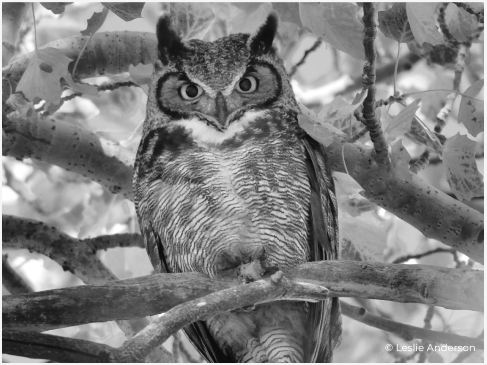
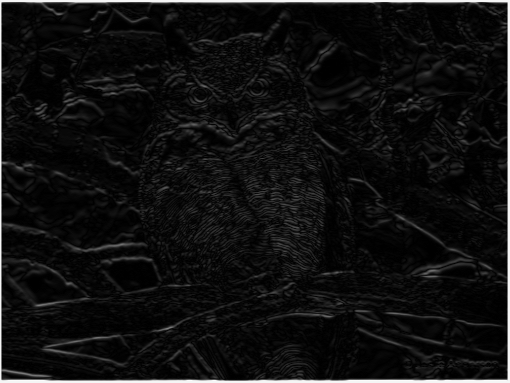
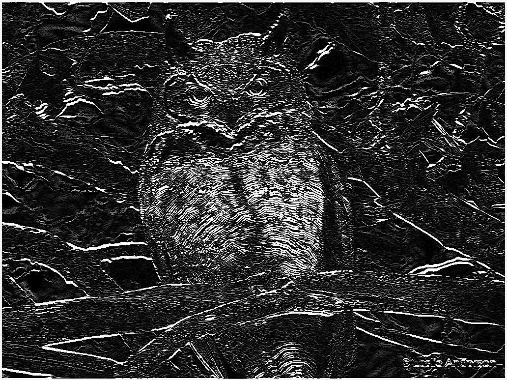
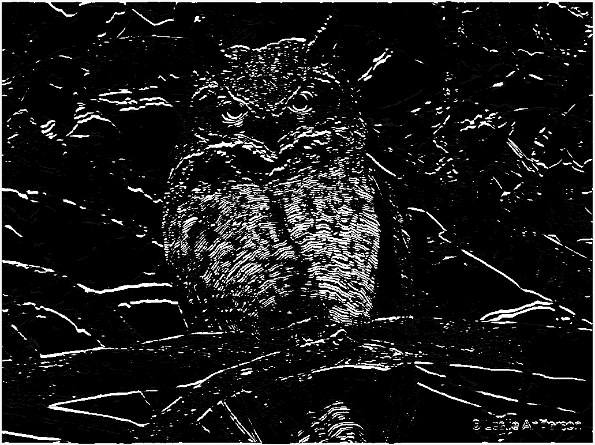
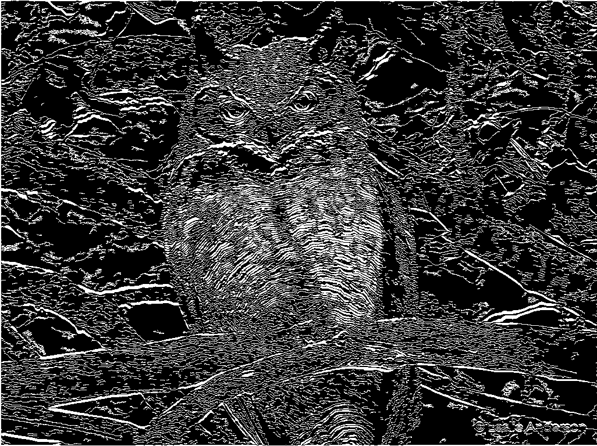

# Edging - Image Edge Detection Implementation

## Resources:

Step by Step Guide:
- https://www.analyticsvidhya.com/blog/2022/08/comprehensive-guide-to-edge-detection-algorithms/
- https://en.wikipedia.org/wiki/Canny_edge_detector
- 

- [x] Greyscale conversion
    - https://www.kaggle.com/code/bishowlamsal/rgb-to-grayscale-image
    - https://stackoverflow.com/questions/42516203/converting-rgba-image-to-grayscale-golang
    - 
- [x] Gaussian Blur
    - https://en.wikipedia.org/wiki/Gaussian_blur
    - https://aryamansharda.medium.com/image-filters-gaussian-blur-eb36db6781b1
    - https://www.southampton.ac.uk/~msn/book/new_demo/gaussian/
    - 
- [x] Finding Intensity of Gradients of the Image
    - https://en.wikipedia.org/wiki/Sobel_operator
    - 
- [x] Non-Max Suppression
    - https://en.wikipedia.org/wiki/Canny_edge_detector#Gradient_magnitude_thresholding_or_lower_bound_cut-off_suppression
    - 
- [x] Double Threshold
    - https://towardsdatascience.com/canny-edge-detection-step-by-step-in-python-computer-vision-b49c3a2d8123
    - 
- [x] Edge Tracking by Hysteresis
    - 
