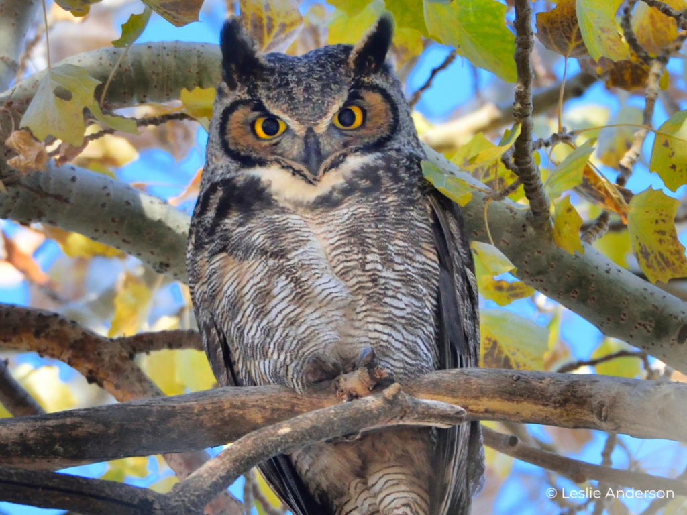

# Edging - Image Edge Detection Implementation

## Resources:

- Step by Step Guide: https://www.analyticsvidhya.com/blog/2022/08/comprehensive-guide-to-edge-detection-algorithms/
    - 

- [x] Greyscale conversion
    - https://www.kaggle.com/code/bishowlamsal/rgb-to-grayscale-image
    - https://stackoverflow.com/questions/42516203/converting-rgba-image-to-grayscale-golang
    - 
- [x] Gaussian Blur
    - https://en.wikipedia.org/wiki/Gaussian_blur
    - https://aryamansharda.medium.com/image-filters-gaussian-blur-eb36db6781b1
    - https://www.southampton.ac.uk/~msn/book/new_demo/gaussian/
    - 
- [ ] Finding Intensity of Gradients of the Image
- [ ] Non-Max Suppression
- [ ] Double Threshold
- [ ] Edge Tracking by Hysteresis
